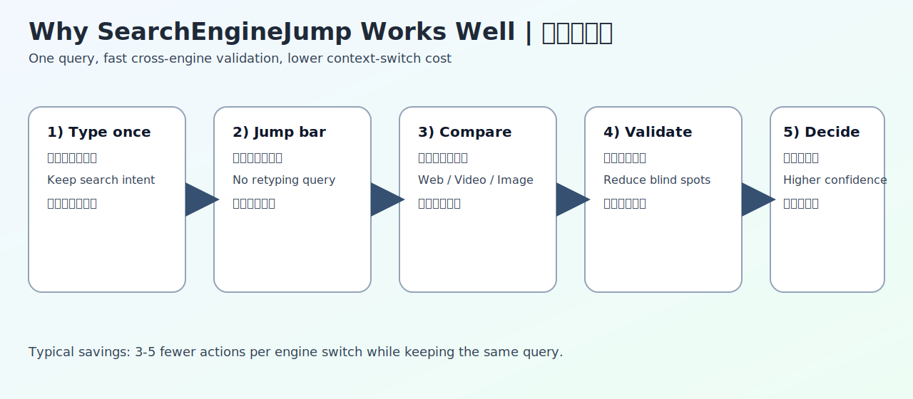
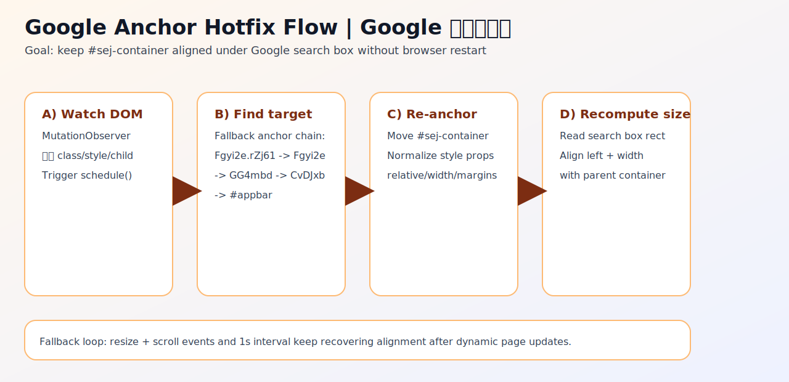

# searchEngineJump 接手维护版

## 中文说明

### 项目状态
- 原项目的交互思路非常好，但 Google 结果页结构变化后，定位稳定性维护不足。
- 这个仓库是接手维护分支，目标是把“搜索后快速跨引擎跳转”这件事继续做好。

### 这个插件为什么好用
1. 一次输入，跨引擎复用关键词。  
   不用反复复制/粘贴/重搜。
2. 降低切换成本。  
   对比结果时，通常每次可减少 3-5 次操作。
3. 规则驱动，可扩展。  
   主脚本里有大量站点规则，能精细控制“挂载位置、关键词提取、样式”。
4. Google 页面更稳。  
   维护版增加了 Google 挂载目标回退链与热修思路，减少滚动后错位和消失。

### 图解

#### 图 1：用户价值流程


#### 图 2：Google 定位热修复流程


### 本地使用与升级（含旧数据兼容）

#### 结论
- 维护版主脚本已经改成和旧版同身份：
  - `@name`: `searchEngineJump 搜索引擎快捷跳转`
  - `@namespace`: `https://greasyfork.org/zh-CN/scripts/27752-searchenginejump`
- 这样在 Tampermonkey 中会走“覆盖升级”，旧配置（`searchEngineJumpData`）会直接沿用。

#### 你现在需要做的
1. 安装或更新主脚本：  
   `https://raw.githubusercontent.com/constansino/searchenginejump-maintained-fork/main/scripts/searchEngineJump_google_anchor_test.user.js`
2. 若你只想补 Google 定位，可额外安装热修：  
   `https://raw.githubusercontent.com/constansino/searchenginejump-maintained-fork/main/scripts/SEJ_Google_Position_Hotfix.user.js`
3. 刷新 Google 结果页验证：跳转栏应贴合搜索框下方。

### 旧数据迁移说明

#### 场景 A：你之前用的是官方旧版 `searchEngineJump 搜索引擎快捷跳转`
- 不需要手动导入。
- 直接安装本维护版主脚本即可继承旧数据。

#### 场景 B：你之前用的是你自己改名的“测试版脚本”
- 这类脚本通常是独立存储空间，不能自动跨脚本读数据。
- 做法：
1. 在旧脚本设置页导出配置码。
2. 在维护版脚本设置页粘贴导入配置码。

### 仓库结构

```text
scripts/
  searchEngineJump_google_anchor_test.user.js   # 主维护脚本（建议安装）
  SEJ_Google_Position_Hotfix.user.js            # Google 定位热修
  searchEngineJump_5.26.7_upstream.user.js      # 上游基线参考

docs/images/
  value-flow.svg
  google-hotfix-flow.svg
```

## English Overview

### Status
This repository is an actively maintained fork focused on preserving the core UX of SearchEngineJump while improving Google result-page anchoring reliability.

### Why it is useful
1. Query once, compare across engines quickly.
2. Fewer context-switch actions during verification.
3. Rule-driven architecture with broad extensibility.
4. Better resilience against Google DOM shifts.

### Data compatibility
The maintained main script now intentionally keeps the legacy identity:
- `@name`: `searchEngineJump 搜索引擎快捷跳转`
- `@namespace`: `https://greasyfork.org/zh-CN/scripts/27752-searchenginejump`

This allows Tampermonkey to treat it as an upgrade path and reuse legacy `searchEngineJumpData` in the common old-script scenario.

### Quick install
- Main script:  
  `https://raw.githubusercontent.com/constansino/searchenginejump-maintained-fork/main/scripts/searchEngineJump_google_anchor_test.user.js`
- Google hotfix:  
  `https://raw.githubusercontent.com/constansino/searchenginejump-maintained-fork/main/scripts/SEJ_Google_Position_Hotfix.user.js`
